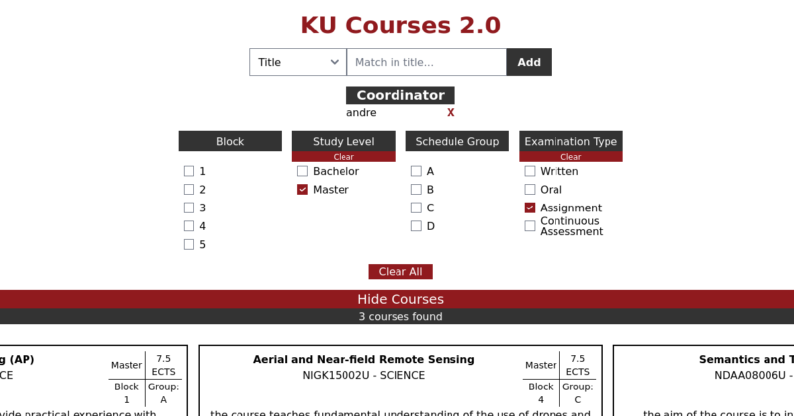

# KU-Courses

The entire application is governed through the `docker-compose.yml` file and is built with `docker compose`:

## Starting the application
1. Install `docker` and `docker-compose`, this may need a restart of your system since Docker is a very low level program.
2. Run `docker compose up --build` as either a user with permissions to docker, or with `sudo`/`doas`, the build flag is required if the backend or frontend code has been changed, additionally `-d` will make it detach from the terminal.
3. Wait for the scraper in the backend to complete scraping pages, this may take about 15 minutes.
4. Run `docker compose restart`, this is required so that the parser will run and so that the vector store can create new embeddings.
5. ???
6. PROFIT!!!

## db-manager
The backend is built with Clojure, a functional programmering language based on Lisp which runs on the Java Virtual Machine.  
This part serves multiple purposes, it is responsible for scraping the course pages from KU as well as the statistics from STADS.  
The backend also serves the frontend and contains the "datascript" database and is responsible for refreshing and various services occasionally (this feature is partially broken at the moment).

## vector_store
This service is responsible for the semantic searches used in the `get_course_overviews` route, instead of using trigrams or full-text, we decided to use vector searches for the lower latency.

## rust_parser
This service is the parser that takes the scraped course pages and parses them into a format we can use in the database for searching and for serving to the frontend.

## frontend
Frontend is built in Svelte/Typescript. This is a highly responsible SPA that shows the courses in the form of cards which can be clicked into to get a more detailed view of the course.
